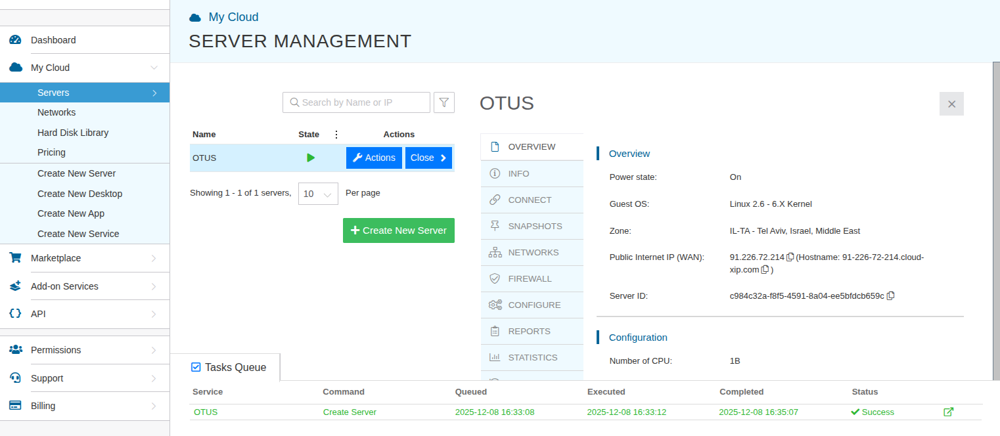
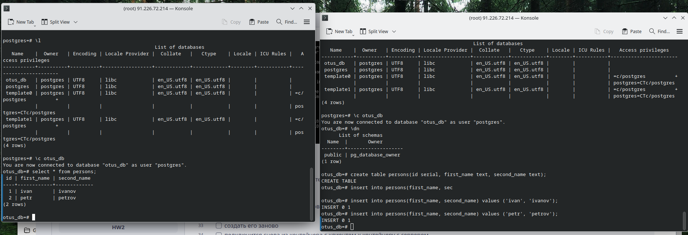

#postgresql #otus 
## Домашнее задание
	Установка и настройка PostgteSQL в контейнере Docker
Цель:
- установить PostgreSQL в Docker контейнере
- настроить контейнер для внешнего подключения

Описание/Пошаговая инструкция выполнения домашнего задания:

- [x] создать ВМ с Ubuntu 20.04/22.04 или развернуть докер любым удобным способом
	-**cоздана ВМ у облачного провайдера с Ubuntu**
	
	
- [x] поставить на нем Docker Engine

- [x] сделать каталог /var/lib/postgres
	-**скорее каталог /var/lib/postgresql**
	
- [x] развернуть контейнер с PostgreSQL 15 смонтировав в него /var/lib/postgresql
- [x] развернуть контейнер с клиентом postgres
	- **ставил последнюю версию 18.1, а там изменена схема хранения данных и нужно монтировать другой путь, иначе контейнер не запускается. пришлось удалить контейнер и заново ставить с путем -v /var/lib/postgresql:/var/lib/postgresql**

- [x] подключится
	 

- [x] из контейнера с клиентом к контейнеру с сервером и сделать таблицу с парой строк

- [x] подключится к контейнеру с сервером с ноутбука/компьютера извне инстансов ЯО/места установки докера
- [x] удалить контейнер с сервером
- [x] создать его заново

- [x] подключится снова из контейнера с клиентом к контейнеру с сервером
- [x] проверить, что данные остались на месте

- [x] оставляйте в ЛК ДЗ комментарии что и как вы делали и как боролись с проблемами