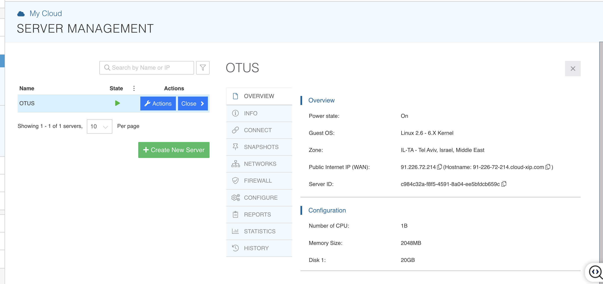
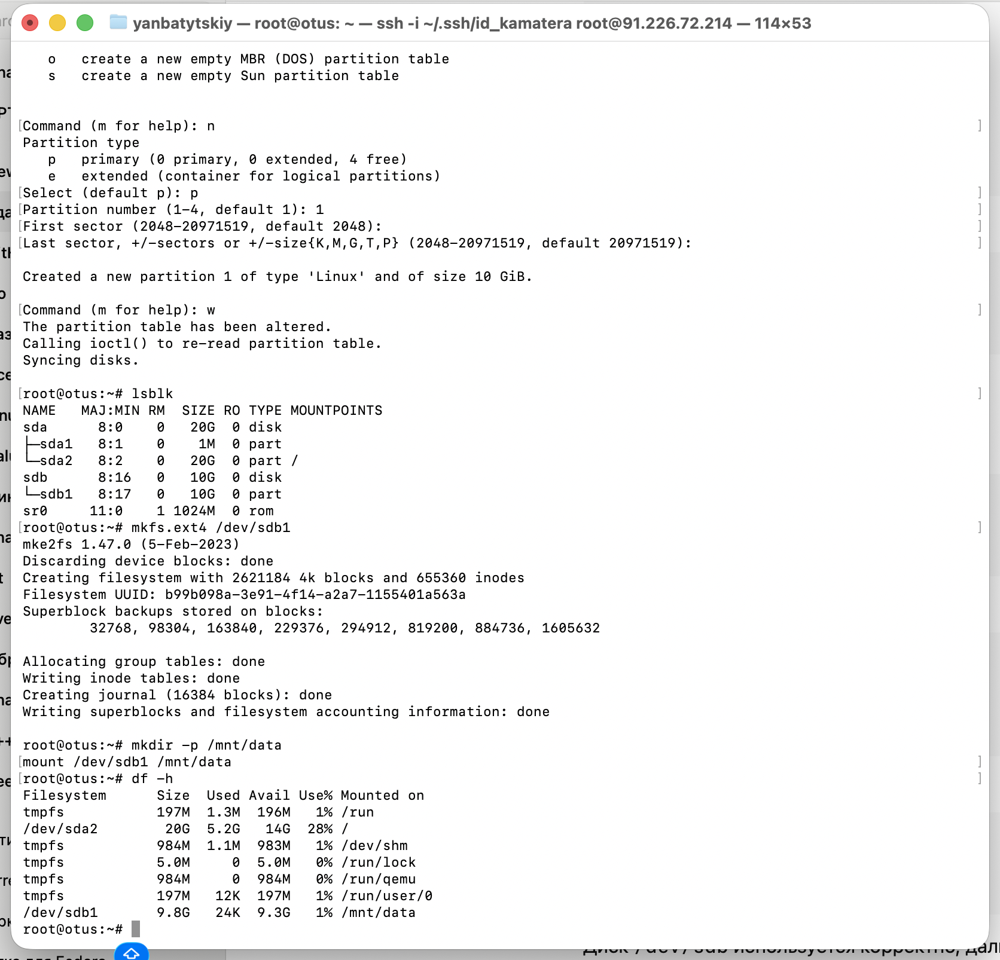

#postgresql #otus
- создайте виртуальную машину c Ubuntu 20.04/22.04 LTS в ЯО/Virtual Box/докере
- 

- поставьте на нее PostgreSQL 15 через sudo apt
- проверьте что кластер запущен через sudo -u postgres pg_lsclusters
- зайдите из под пользователя postgres в psql и сделайте произвольную таблицу с произвольным содержимым  
    postgres=# create table test(c1 text);  
    postgres=# insert into test values('1');  
    \q
- остановите postgres например через sudo -u postgres pg_ctlcluster 15 main stop
	
	
- создайте новый диск к ВМ размером 10GB
	

- добавьте свеже-созданный диск к виртуальной машине - надо зайти в режим ее редактирования и дальше выбрать пункт attach existing disk
- проинициализируйте диск согласно инструкции и подмонтировать файловую систему, только не забывайте менять имя диска на актуальное, в вашем случае это скорее всего будет /dev/sdb - [https://www.digitalocean.com/community/tutorials/how-to-partition-and-format-storage-devices-in-linux](https://www.digitalocean.com/community/tutorials/how-to-partition-and-format-storage-devices-in-linux "https://www.digitalocean.com/community/tutorials/how-to-partition-and-format-storage-devices-in-linux")
- перезагрузите инстанс и убедитесь, что диск остается примонтированным (если не так смотрим в сторону fstab)


- сделайте пользователя postgres владельцем /mnt/data - chown -R postgres:postgres /mnt/data/
- перенесите содержимое /var/lib/postgres/15 в /mnt/data - mv /var/lib/postgresql/15/mnt/data
	Содержимое папки это команда cp, а не mv
		chown -R postgres:postgres /mnt/data/
		cp -a /var/lib/postgresql/18/. /mnt/data/


- попытайтесь запустить кластер - sudo -u postgres pg_ctlcluster 15 main start
- напишите получилось или нет и почему - **ищет данные по старому пути**


- задание: найти конфигурационный параметр в файлах раположенных в /etc/postgresql/15/main который надо поменять и поменяйте его
- напишите что и почему поменяли
- ```
	root@otus:/mnt/data# cd /etc/
	root@otus:/etc# cd postgresql/
	root@otus:/etc/postgresql# cd 18
	root@otus:/etc/postgresql/18# cd main
	root@otus:/etc/postgresql/18/main# ls -la
	
	drwxr-xr-x 3 postgres postgres  4096 Dec 16 15:27 **.**
	drwxr-xr-x 3 postgres postgres  4096 Dec 16 15:26 **..**
	drwxr-xr-x 2 postgres postgres  4096 Dec 16 15:27 **conf.d**
	-rw-r--r-- 1 postgres postgres   315 Dec 16 15:27 environment
	-rw-r--r-- 1 postgres postgres   143 Dec 16 15:27 pg_ctl.conf
	-rw-r----- 1 postgres postgres  5934 Dec 16 15:27 pg_hba.conf
	-rw-r----- 1 postgres postgres  2681 Dec 16 15:27 pg_ident.conf
	-rw-r--r-- 1 postgres postgres 32505 Dec 16 15:27 postgresql.conf
	-rw-r--r-- 1 postgres postgres   317 Dec 16 15:27 start.conf
	root@otus:/etc/postgresql/18/main#
	```
поменяли /var/lib/postgresql/18/main на /mnt/data/18/main
```
root@otus:/etc/postgresql/18/main# nano postgresql.conf 
root@otus:/etc/postgresql/18/main# pg_ctlcluster 18 main start
root@otus:/etc/postgresql/18/main# sudo -u postgres psql -c "show data_directory;"
  data_directory   
-------------------
 /mnt/data/18/main
(1 row)
root@otus:/etc/postgresql/18/main#
```

- попытайтесь запустить кластер - sudo -u postgres pg_ctlcluster 15 main start
- напишите получилось или нет и почему
**все работает. Правильно указана папка с данными.**

- зайдите через через psql и проверьте содержимое ранее созданной таблицы
```
root@otus:/etc/postgresql/18/main# sudo -u postgres psql -c "show data_directory;"
  data_directory   
-------------------
 /mnt/data/18/main
(1 row)
  
root@otus:/etc/postgresql/18/main# sudo -u postgres psql
psql (18.1 (Ubuntu 18.1-1.pgdg24.04+2))
Type "help" for help.

postgres=# select * from test;
 c1 
----
 1
(1 row)
  
postgres=#
```

- задание со звездочкой *: не удаляя существующий инстанс ВМ сделайте новый, поставьте на его PostgreSQL, удалите файлы с данными из /var/lib/postgres, перемонтируйте внешний диск который сделали ранее от первой виртуальной машины ко второй и запустите PostgreSQL на второй машине так чтобы он работал с данными на внешнем диске, расскажите как вы это сделали и что в итоге получилось.

**так как данные лежат на внешнем физическом диске, то все равно к которой виртуальной машине мы его подключаем. Работает одинаково.**