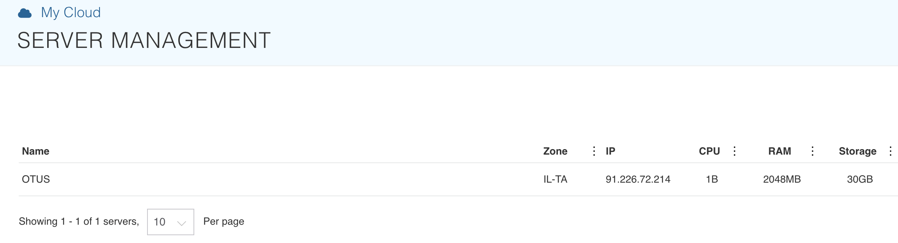
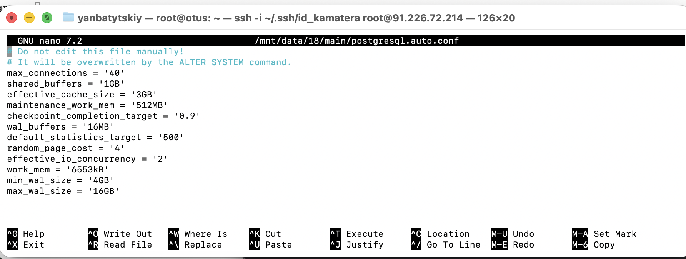

#postgresql #otus 
## Домашнее задание

Настройка autovacuum с учетом особеностей производительности

Цель:

- запустить нагрузочный тест pgbench
- настроить параметры autovacuum
- проверить работу autovacuum  

Описание/Пошаговая инструкция выполнения домашнего задания:

- Создать инстанс ВМ с 2 ядрами и 4 Гб ОЗУ и SSD 10GB
есть только такая:


- Установить на него PostgreSQL 15 с дефолтными настройками
все настройки сброшены:
```bash
postgres=# SELECT name, setting, source, sourcefile, sourceline
postgres-# FROM pg_settings
postgres-# WHERE source = 'override'
postgres-# ORDER BY name;

          name          |                 setting                 |  source  | sourcefile | sourceline 

------------------------+-----------------------------------------+----------+
 config_file            | /etc/postgresql/18/main/postgresql.conf | override |            |     
 data_directory         | /mnt/data/18/main                       | override |            |           
 hba_file               | /etc/postgresql/18/main/pg_hba.conf     | override |            |           
 ident_file             | /etc/postgresql/18/main/pg_ident.conf   | override |            |           
 transaction_deferrable | off                                     | override |            |           
 transaction_isolation  | read committed                          | override |            |           

 transaction_read_only  | off                                     | override |            |           
(7 rows)
```

- Создать БД для тестов: выполнить pgbench -i postgres
- Запустить pgbench -c8 -P 6 -T 60 -U postgres postgres
```
postgres@otus:~$ pgbench -c8 -P 6 -T 60 -U postgres postgres
pgbench (18.1 (Ubuntu 18.1-1.pgdg24.04+2))

transaction type: <builtin: TPC-B (sort of)>
scaling factor: 1
query mode: simple
number of clients: 8
number of threads: 1
maximum number of tries: 1
duration: 60 s
number of transactions actually processed: 116380
number of failed transactions: 0 (0.000%)
latency average = 4.122 ms
latency stddev = 2.902 ms
initial connection time = 17.967 ms
tps = 1939.677626 (without initial connection time)

postgres@otus:~$
```

- Применить параметры настройки PostgreSQL из прикрепленного к материалам занятия файла

- Протестировать заново
```
transaction type: <builtin: TPC-B (sort of)>

scaling factor: 1
query mode: simple
number of clients: 8
number of threads: 1
maximum number of tries: 1
duration: 60 s
number of transactions actually processed: 120080
number of failed transactions: 0 (0.000%)
latency average = 3.995 ms
latency stddev = 2.812 ms
initial connection time = 20.011 ms
tps = 2001.432438 (without initial connection time)

postgres@otus:~$
```

- Что изменилось и почему?
	 - фактически памяти 2гб, а мы выделили 50 % для буфера
	 - кэш поставили 3гб и нарушили общее правило, что сумма этих двух памятей не должна превышать ОЗУ - планировщик начнет косячить
	 - цена чтения слишком высокая для SSD
	 - настройки WAL не подходят под существующий диск а 30 Гб - запросто заглючит и уронит скорость
	 - - effective_io_concurrency = 2 - это под медленный hdd 

	но при этом tps вырос, потому что большой WAL с редким сливом данных.

	**но скорее всего рост идет из-за прогретого кэша.**

- Создать таблицу с текстовым полем и заполнить случайными или сгенерированными данным в размере 1млн строк
```
postgres=# create table test1 as select 'abc' from generate_series(1, 1000000);
SELECT 1000000
ALTER TABLE test1 RENAME COLUMN "?column?" TO txt;
postgres=#
```

- Посмотреть размер файла с таблицей
	```
	postgres=# select pg_size_pretty(pg_total_relation_size('test1'));
	
	35 MB
	```

- 5 раз обновить все строчки и добавить к каждой строчке любой символ
```
postgres=# update test1 SET txt = txt || 'a';
UPDATE 1000000
postgres=# update test1 SET txt = txt || 'b';
UPDATE 1000000
postgres=# update test1 SET txt = txt || 'c';
UPDATE 1000000
postgres=# update test1 SET txt = txt || 'd';
UPDATE 1000000
postgres=# update test1 SET txt = txt || 'e';
UPDATE 1000000

postgres=#
```

- Посмотреть количество мертвых строчек в таблице и когда последний раз приходил автовакуум
автовакуум последний раз меня посещал два часа назад, но пять операций UPDATE сами вычистили предыдущие версии. сhatGPT считает, что сработал **pruning**
```
postgres=# select relname, n_live_tup, n_dead_tup, trunc(100*n_dead_tup/(n_live_tup+1))::float "ratio%",last_autovacuum                            from pg_stat_user_tables where relname = 'test1';

 relname | n_live_tup | n_dead_tup | ratio% |        last_autovacuum        
---------+------------+------------+--------+-------------------------------
 test1   |    1000000 |          0 |      0 | 2025-12-27 14:10:24.518206+00
(1 row)


postgres=#
```

- Подождать некоторое время, проверяя, пришел ли автовакуум

- 5 раз обновить все строчки и добавить к каждой строчке любой символ
```
postgres=# UPDATE test1 SET txt = txt || 'z';
UPDATE 1000000
postgres=# UPDATE test1 SET txt = txt || 'x';
UPDATE 1000000
postgres=# UPDATE test1 SET txt = txt || 'c';
UPDATE 1000000
postgres=# UPDATE test1 SET txt = txt || 'v';
UPDATE 1000000
postgres=# UPDATE test1 SET txt = txt || 'b';
UPDATE 1000000

postgres=# select relname, n_live_tup, n_dead_tup, trunc(100*n_dead_tup/(n_live_tup+1))::float "ratio%",last_autovacuum                            from pg_stat_user_tables where relname = 'test1';

 relname | n_live_tup | n_dead_tup | ratio% |        last_autovacuum        
---------+------------+------------+--------+-------------------------------
 test1   |    1000000 |    4999545 |    499 | 2025-12-27 14:10:24.518206+00
(1 row)
```

- Посмотреть размер файла с таблицей
- Отключить Автовакуум на конкретной таблице
```sql
ALTER TABLE test1 SET (autovacuum_enabled = false);
```
- 10 раз обновить все строчки и добавить к каждой строчке любой символ
```
UPDATE test1 SET txt = txt || 'z';
UPDATE test1 SET txt = txt || 'x';
UPDATE test1 SET txt = txt || 'c';
UPDATE test1 SET txt = txt || 'v';
UPDATE test1 SET txt = txt || 'b';
UPDATE test1 SET txt = txt || 'q';
UPDATE test1 SET txt = txt || 'w';
UPDATE test1 SET txt = txt || 'e';
UPDATE test1 SET txt = txt || 'r';
UPDATE test1 SET txt = txt || 't';
```

- Посмотреть размер файла с таблицей
```
postgres=# SELECT pg_size_pretty(pg_total_relation_size('test1'));
 pg_size_pretty 
----------------
 525 MB
(1 row)
```

- Объясните полученный результат
	- потому что Postgres делает копию строки при обновлении

- Не забудьте включить автовакуум)
```
postgres=# alter table test1 set (autovacuum_enabled=true);
ALTER TABLE
postgres=#
```

Задание со *:  
Написать анонимную процедуру, в которой в цикле 10 раз обновятся все строчки в искомой таблице.  
Не забыть вывести номер шага цикла.