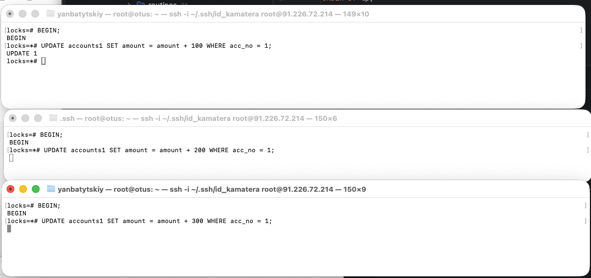
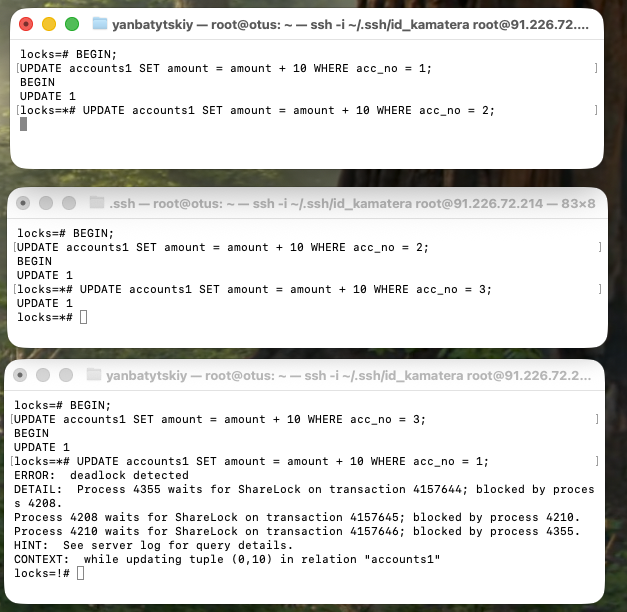

#postgresql  #otus 
## Домашнее задание

Механизм блокировок

Цель:

понимать как работает механизм блокировок объектов и строк;

Описание/Пошаговая инструкция выполнения домашнего задания:

1. Настройте сервер так, чтобы в журнал сообщений сбрасывалась информация о блокировках, удерживаемых более 200 миллисекунд. Воспроизведите ситуацию, при которой в журнале появятся такие сообщения.
```
locks=# ALTER SYSTEM SET log_lock_waits = on;
ALTER SYSTEM SET deadlock_timeout = '200ms';
ALTER SYSTEM SET logging_collector=on;
SELECT pg_reload_conf();
ALTER SYSTEM
ALTER SYSTEM
 pg_reload_conf 
----------------
 t
(1 row)
locks=#
```
Плюс перезапуск сервера.
Нужно повесить блокировку на более чем 200 мс и подождать, затем посмотреть журнал
Логи нашлись в файле:
```
2026-01-10 20:01:18.444 UTC [4222] postgres@locks LOG:  process 4222 still waiting for ShareLock on transaction 4157635 after 200.097 ms

2026-01-10 20:01:18.444 UTC [4222] postgres@locks DETAIL:  Process holding the lock: 4210. Wait queue: 4222.

2026-01-10 20:01:18.444 UTC [4222] postgres@locks CONTEXT:  while updating tuple (0,4) in relation "accounts1"

2026-01-10 20:01:18.444 UTC [4222] postgres@locks STATEMENT:  UPDATE accounts1 SET amount = amount + 100 WHERE acc_no = 1
```


2. Смоделируйте ситуацию обновления одной и той же строки тремя командами UPDATE в разных сеансах. Изучите возникшие блокировки в представлении pg_locks и убедитесь, что все они понятны. Пришлите список блокировок и объясните, что значит каждая.



```
root@otus:/mnt/data/18/main/log# tail -f postgresql-2026-01-10_195537.log 

2026-01-10 20:03:08.033 UTC [4174] LOG:  checkpoint complete: wrote 1 buffers (0.0%), wrote 0 SLRU buffers; 0 WAL file(s) added, 0 removed, 0 recycled; write=0.102 s, sync=0.003 s, total=0.110 s; sync files=1, longest=0.003 s, average=0.003 s; distance=0 kB, estimate=11 kB; lsn=1/AC13AC58, redo lsn=1/AC13AC00

2026-01-10 20:05:37.163 UTC [4174] LOG:  checkpoint starting: time

2026-01-10 20:05:37.269 UTC [4174] LOG:  checkpoint complete: wrote 1 buffers (0.0%), wrote 0 SLRU buffers; 0 WAL file(s) added, 0 removed, 0 recycled; write=0.103 s, sync=0.001 s, total=0.106 s; sync files=1, longest=0.001 s, average=0.001 s; distance=0 kB, estimate=10 kB; lsn=1/AC13AFA0, redo lsn=1/AC13AF48

2026-01-10 20:05:42.728 UTC [4210] postgres@locks LOG:  process 4210 still waiting for ShareLock on transaction 4157638 after 200.107 ms

2026-01-10 20:05:42.728 UTC [4210] postgres@locks DETAIL:  Process holding the lock: 4208. Wait queue: 4210.

2026-01-10 20:05:42.728 UTC [4210] postgres@locks CONTEXT:  while updating tuple (0,10) in relation "accounts1"

2026-01-10 20:05:42.728 UTC [4210] postgres@locks STATEMENT:  UPDATE accounts1 SET amount = amount + 200 WHERE acc_no = 1;

2026-01-10 20:05:52.533 UTC [4355] postgres@locks LOG:  process 4355 still waiting for ExclusiveLock on tuple (0,10) of relation 17509 of database 17483 after 200.105 ms

2026-01-10 20:05:52.533 UTC [4355] postgres@locks DETAIL:  Process holding the lock: 4210. Wait queue: 4355.

2026-01-10 20:05:52.533 UTC [4355] postgres@locks STATEMENT:  UPDATE accounts1 SET amount = amount + 300 WHERE acc_no = 1;
```

По логу журнала:
1. Удерживает блокировку 4208
2. Первым в очереди ждет 4210, затем в очереди стоит 4355

3. Воспроизведите взаимоблокировку трех транзакций. Можно ли разобраться в ситуации постфактум, изучая журнал сообщений?


в журнале указано, что произошел дедлок.
```
2026-01-10 20:32:15.379 UTC [4208] postgres@locks LOG:  process 4208 still waiting for ShareLock on transaction 4157645 after 200.090 ms
2026-01-10 20:32:15.379 UTC [4208] postgres@locks DETAIL:  Process holding the lock: 4210. Wait queue: 4208.
2026-01-10 20:32:15.379 UTC [4208] postgres@locks CONTEXT:  while updating tuple (0,2) in relation "accounts1"
2026-01-10 20:32:15.379 UTC [4208] postgres@locks STATEMENT:  UPDATE accounts1 SET amount = amount + 10 WHERE acc_no = 2;
2026-01-10 20:32:21.141 UTC [4210] postgres@locks LOG:  process 4210 still waiting for ShareLock on transaction 4157646 after 200.082 ms
2026-01-10 20:32:21.141 UTC [4210] postgres@locks DETAIL:  Process holding the lock: 4355. Wait queue: 4210.
2026-01-10 20:32:21.141 UTC [4210] postgres@locks CONTEXT:  while updating tuple (0,3) in relation "accounts1"
2026-01-10 20:32:21.141 UTC [4210] postgres@locks STATEMENT:  UPDATE accounts1 SET amount = amount + 10 WHERE acc_no = 3;
2026-01-10 20:32:27.334 UTC [4355] postgres@locks LOG:  process 4355 detected deadlock while waiting for ShareLock on transaction 4157644 after 200.100 ms
2026-01-10 20:32:27.334 UTC [4355] postgres@locks DETAIL:  Process holding the lock: 4208. Wait queue: .
2026-01-10 20:32:27.334 UTC [4355] postgres@locks CONTEXT:  while updating tuple (0,10) in relation "accounts1"
2026-01-10 20:32:27.334 UTC [4355] postgres@locks STATEMENT:  UPDATE accounts1 SET amount = amount + 10 WHERE acc_no = 1;
2026-01-10 20:32:27.334 UTC [4355] postgres@locks ERROR:  deadlock detected
```

4. Могут ли две транзакции, выполняющие единственную команду UPDATE одной и той же таблицы (без where), заблокировать друг друга?      

взаимной блокировки без дополнительной логики ограничений тут нет, есть обычное ожидание строки

**Задание со звездочкой** *  
  
Попробуйте воспроизвести такую ситуацию.