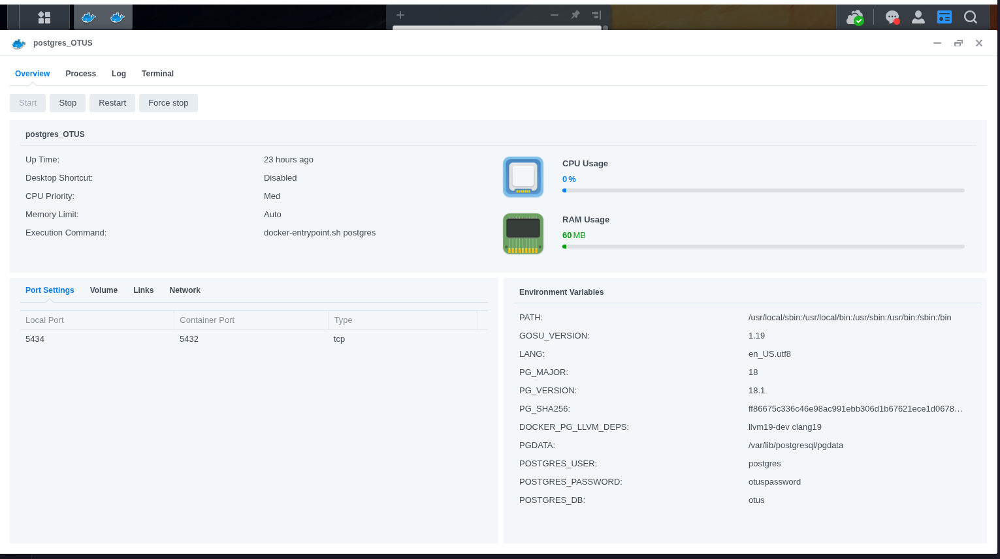
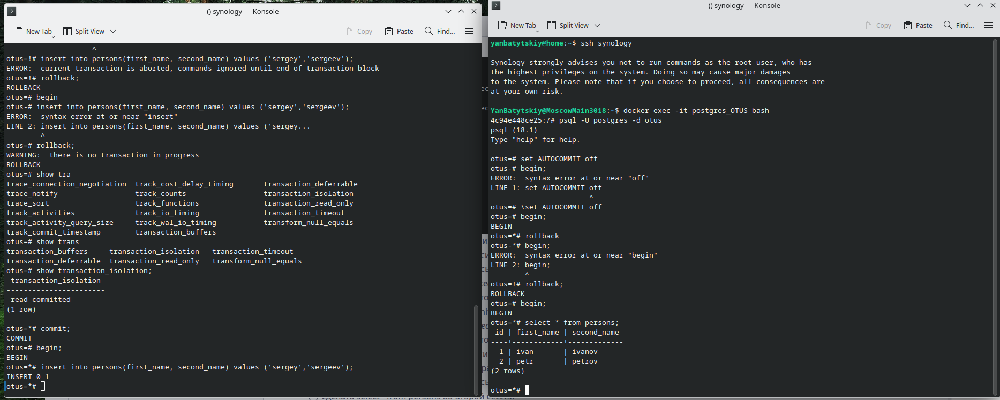

#postgresql #otus 
1. База PostgreSQL  развернута в Docker на NAS-сервере Synology


2. Разворачивание происходит по отдельно выделенному SSH контексту с использованием docker-compose и makefile - мне так удобнее давать однотипные команды и прописывать параменры в env файле, потому что у меня несколько контейнеров с разными базами. 
docker-compose:
```
	services:
  postgres:
    image: postgres:${POSTGRES_VERSION}
    container_name: ${CONTAINER_NAME}
    restart: unless-stopped
    # Run as root so the entrypoint can chown the mounted volume, then it will drop to the postgres user.
    user: "0:0"
    environment:
      POSTGRES_DB: ${POSTGRES_DB}
      POSTGRES_USER: ${POSTGRES_USER}
      POSTGRES_PASSWORD: ${POSTGRES_PASSWORD}
      # Use a subdir that doesn't traverse the default 'data' symlink.
      PGDATA: /var/lib/postgresql/pgdata
    ports:
      - "${POSTGRES_PORT}:5432"
    volumes:
      # Mount at the image's VOLUME root to avoid nested anonymous volumes.
      - pgdata:/var/lib/postgresql
      # - ./storage/postgres/init:/docker-entrypoint-initdb.d:ro
    healthcheck:
      test: [ "CMD-SHELL", "pg_isready -U ${POSTGRES_USER} -d ${POSTGRES_DB} -h localhost" ]
      interval: 2s
      timeout: 3s
      retries: 15
      
volumes:
  pgdata:
  ```
  makefile:
  ```
  a.PHONY: up down build run dev-up clean migrate delete

include .env
COMPOSE_FILE=docker-compose.yml
ENV_FILE=.env
PROJECT_NAME=otus

# Database commands
up:
		docker context use synology
		docker compose --project-name ${PROJECT_NAME} -f $(COMPOSE_FILE) --env-file $(ENV_FILE) up -d
down:
		docker context use synology
		docker compose --project-name ${PROJECT_NAME} -f $(COMPOSE_FILE) --env-file $(ENV_FILE) down
delete:
		docker context use synology
		docker compose --project-name ${PROJECT_NAME} -f $(COMPOSE_FILE) --env-file $(ENV_FILE) down -v
```
3. Вход по SSH:


- [x] в первой сессии новую таблицу и наполнить ее данными create table persons(id serial, first_name text, second_name text); insert into persons(first_name, second_name) values('ivan', 'ivanov'); insert into persons(first_name, second_name) values('petr', 'petrov'); commit;

- [x] посмотреть текущий уровень изоляции: show transaction isolation level
- [x] начать новую транзакцию в обоих сессиях с дефолтным (не меняя) уровнем изоляции
- [x] в первой сессии добавить новую запись insert into persons(first_name, second_name) values('sergey', 'sergeev');
- [x] сделать select _from persons во второй сессии_

- [x] видите ли вы новую запись и если да то почему?
	-**новую запись во второй сессии не видно, потому что в первой не закончена транзакция команндой COMMIT;, а уровень изоляции не позволяет грязное чтение**
	
- [x] завершить первую транзакцию - commit;
- [x] сделать _select from persons во второй сессии_
- [x] видите ли вы новую запись и если да то почему?
	- **после команды COMMIT во второй сессии запись появилась, так как транзакция была завершена успешно.**
	
- [x] завершите транзакцию во второй сессии
- [x] начать новые но уже repeatable read транзации - set transaction isolation level repeatable read;
- [x] в первой сессии добавить новую запись insert into persons(first_name, second_name) values('sveta', 'svetova');
- [x] сделать select* from persons во второй сессии*


- [x] видите ли вы новую запись и если да то почему?
	-**запись не видна, так как грязное чтение не разрешено.**
	
- [x] завершить первую транзакцию - commit;
- [x] сделать select _from persons во второй сессии_
- [x] видите ли вы новую запись и если да то почему?
	-**запись не видна во второй сессии, потому что при repeatable read не разрешает обновлять данные до завершения собственной транзакции.**
	
- [x] завершить вторую транзакцию
- [x] сделать select * from persons во второй сессии
- [x] видите ли вы новую запись и если да то почему?
	-**запись видна, потому что завершена текущая транзакция во второй сессии.**
